# Proyecto-PDM
proyecto-rootuser created by GitHub Classroom

# Enlace al vídeo
https://youtu.be/jDdMVz3bwgU

# Usuarios de prueba

**identifier**: UsernameDePrueba3

**email**: correo1@email.com

**password**: Password1


# Manual técnico

### Objetivo del documento
El objetivo del presente documento es orientar y explicar la aplicación desarrollada, exponiendo las herramientas utilizadas. Al mismo tiempo dar a conocer los aspectos y características que forman parte del proyecto con el propósito de que se conozcan las funcionalidades y funciones que la aplicación tiene

### Descripción general
Para la creación del proyecto se utilizó el patron de diseño **Model-view-viewmodel (MVVM)**. La aplicación presenta la creación de una plataforma que busca convertir la experiencia de compra y venta de una propiedad a una actividad grata y fácil de hacer. Al mimo tiempo se busca tener un impacto social, buscando beneficiar a grupos menos favorecidos. Lo antes mencionado se lograra mediante la donación de cierto porcentaje de las ganancias a proyectos sociales como la construcción de lugares para gente sin hogar. 

El principal propósito del software es aprovechar los recursos tecnológicos para ofrecerle a los usuarios una alternativa que les permita ahorrar sus recursos y hacer mas grata la experiencia y compra de una propiedad tomando en cuenta que al mismo tiempo están ayudando al sector mas necesitado del país.

### Software Utilizado
Para la creación de la aplicación se utilizo **Android Studio** con el lenguaje de programación **Kotlin**, en conjunto con **MongoDB**, **node.js** y **express** para la creación tanto de la API como de la base de datos. Se implemento **retrofit** para poder realizar la conexión a la API. Para el control de versiones se utilizo **GIT Hub** y **Click Up** para la administración y distribución de tareas.

#### Link de ClickUp
https://sharing.clickup.com/l/h/4-14962770-1/0f609146c9051f1

### Implementación de interfaz gráfica
La interfaz gráfica de la aplicación consiste unicamente de dos actividades. Una de ellas contiene el fragmento de login y sign up y la otra contiene el resto de los fragmentos de la aplicación. Las vistas se han creado utilizando fragmentos en su totalidad.

## APP
### Diseño
La aplicación cuenta con una interfaz gráfica consistente, buscando que la experiencia de usuario sea la mejor. Se hizo un diseño simple, con colores llamativos pero amigables con los ojos del usuario. La posición de cada elemento es clave para que todo sea de fácil y rápido acceso. El diseño fue pensado con el fin ultimo de la aplicación que es hacer el proceso de búsqueda de un hogar una actividad fácil y placentera. Es importante mencionar que la aplicación no maneja roles ya que un usuario puede actuar como comprador o vendedor bajo la misma cuenta que tiene.

Link a diseño detallado de Figma:  
https://www.figma.com/file/cFPcQTDtchKKWzvqEmY0mv/Dise%C3%B1o-proyecto-moviles
<br>
### Logo Roofify
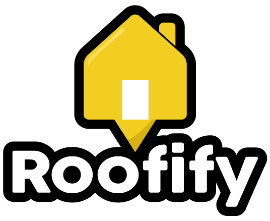
Está compuesto por la silueta de una casa con bordes redondeadas con el objetivo de hacer toda la imagen gráfica amigable para el usuario. En este podemos observar que la casa tiene un triangulo en la parte inferior con la idea de que se asemeje a un pin de ubicación de mapa seguido del nombre de la aplicación (Roofify) con una tipografía adecuada para no saturar el logo. Sumándole a eso, colores brillantes con la intención de llamar la atención del usuario. Se eligió una paleta de colore negra, amarilla y blanca, colores que son llamativos y amigables para la vista al mismo tiempo.
<br><br>
### Login y Signup
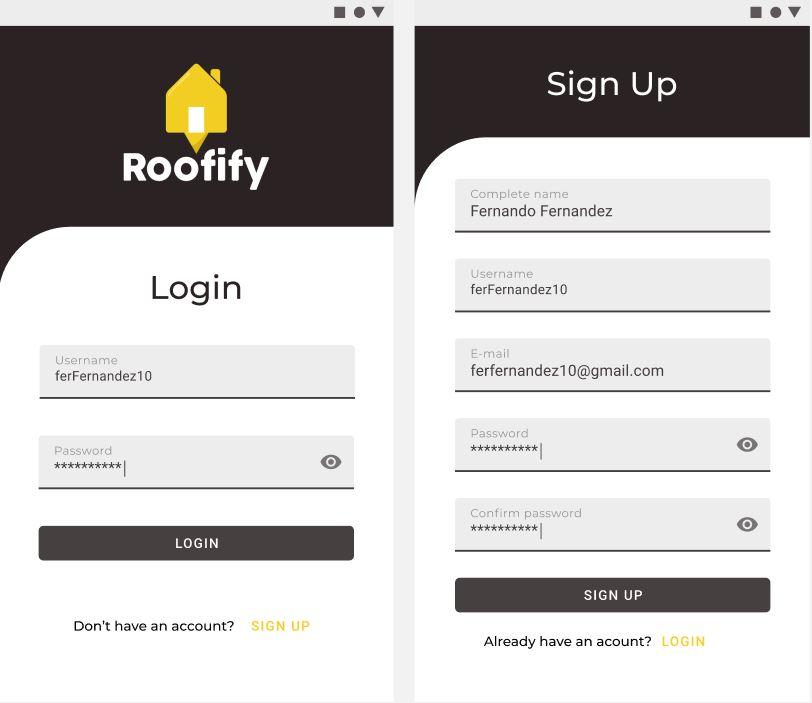
<br><br>El login es la primera vista que tendrá el usuario de la aplicación. El login cuenta con el logo de Roofify en la parte superior para darle identidad a la app. Para ingresar se deberán colocar usuario y contraseña. En dado caso sea un nuevo usuario se puede proceder a ingresar al apartado de sign up donde se solicitara correo, usuario, nombre completo y una contraseña. De la misma forma se puede regresar al formulario de inicio de sesión apretando el area destinada en la parte inferior del botón.<br><br>
<br><br>

### Explore
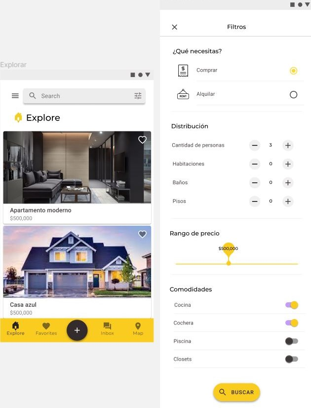
<br>La primera vista a la que se tendrá acceso luego de haber iniciado sesión es la de explorar. En esta vista podrá observar la publicaciones de los diferentes usuarios. El propósito de este apartado es que el usuario pueda explorar diferentes opciones y no limitarse. Este apartado cuenta con una barra de búsqueda y de filtros con el fin de facilitarle aun mas la tarea de buscar su proximo hogar. Algunos de los filtros que se pueden aplicar es el precio, si se desea comprar o alquilar, cantidad de personas, habitaciones, baños y pisos. También se puede seleccionar las comodidades que se desean tener. Si se da click a las cards se muestra la casa o apartamento con mas detalle.<br><br><br>

### Favoritos
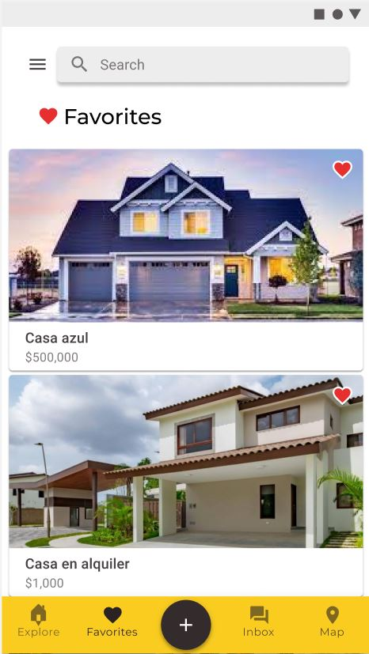 
<br><br><br>La vista de favoritos contiene todas las casas o apartamentos que han llamado la atención del usuario y son potenciales de compra o alquiler. Esto con el propósito de aque se tenga fácil acceso a las propiedades de interés y no se tengan que volver a buscar. El usuario puede eliminar de favoritos las cards en cualquier momento que guste. Si se da click a las cards se muestra la casa o apartamento con mas detalle. Esta sección cuenta con una barra de búsqueda en caso la lista de favoritas sea demasiado extensa.<br><br><br><br>

### Añadir post
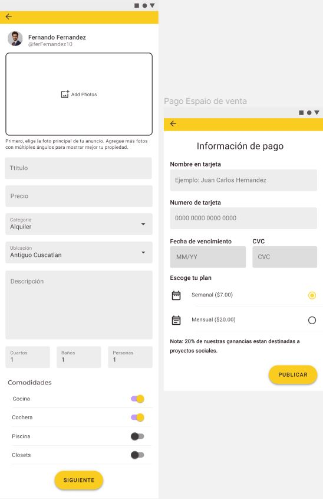
<br><br>En esta vista el usuario puede crear un publicación de la casa o apartamento que desea vender. Aquí el usuario deberá de proporcionar toda la información necesaria y detalles de la propiedad. Entre estas se incluye: descripción, precio, un titulo, categoría, ubicación, cantidad de cuartos, baños y personas, comodidades y fijar la ubicación de la propiedad en el mapa. Adicionalmente se pide una forma de pago y elegir dentro de lo planes que ofrece la aplicación para poder terminar el proceso de publicación. Cabe mencionar que se le da a conocer al usuario que 20% de las ganancias están destinadas a proyecto sociales. Una vez publicada el usuario es redirigido a la ventana de sus propiedades.<br><br><br><br>

### Casa detallada
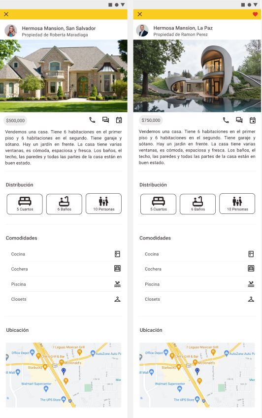
<br><br><br>Como se menciono anteriormente al darle click a alguna de las cards de alguna de las propiedades se abre una ventana que muestra mas detalles de la propiedad. Alguno de ellos son: Una pequeña descripción, el precio, la distribución, comodidades que incluye la propiedad, ubicación de la casa o apartamento y la opción de llamar, mandar mensaje y agendar cita para la visita. Como se puede observar en las imágenes existe una version detallada de las propiedades que pertenecen a la sección de favoritos, la única diferencia es el corazón en la esquina superior derecha.<br><br><br><br>

### Inbox
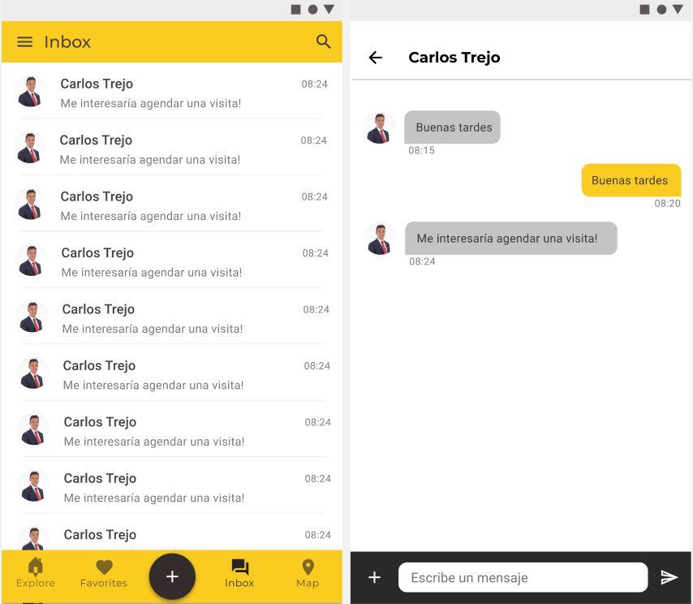
<br><br>En esta vista el usuario tiene acceso a sus mensajes directo tanto como vendedor o comprador. Mediante este medio el usuario podrá resolver cualquier duda que tenga con respecto a la compra o alquiler de la propiedad. Esto es con el objetivo de facilitar la comunicación entre comprador y vendedor. En las imágenes se puede observar tanto el chat general como el detallado.<br><br><br><br>

### Mapa
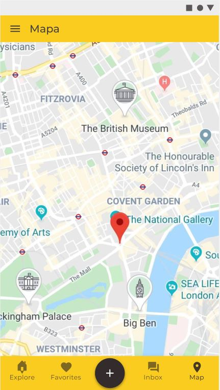 
<br><br><br><br>En esta vista el usuario podrá observar un mapa con todas las propiedades. Esto con el propósito de que sea mas fácil poder filtrar sus opciones. Se sa sabe que la ubicación juega un papel bastante importante en el proceso de elección es por eso que se decidió implementa esta vista. La propiedades aparecerán pineadas en el mapa.<br><br><br><br><br>

### Hamburguer menu
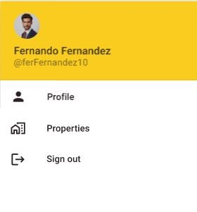
<br><br>Menu despegable que se puede acceder desde explorar, favoritos, inbox y mapa. Desde el se puede acceder a vistas que tienen menos relevancia que las que se encuentra en el bottom navigation bar. Por medio de el se puede acceder a mi perfil, mis propiedades y cerrar sesión.<br><br><br>

### Perfil
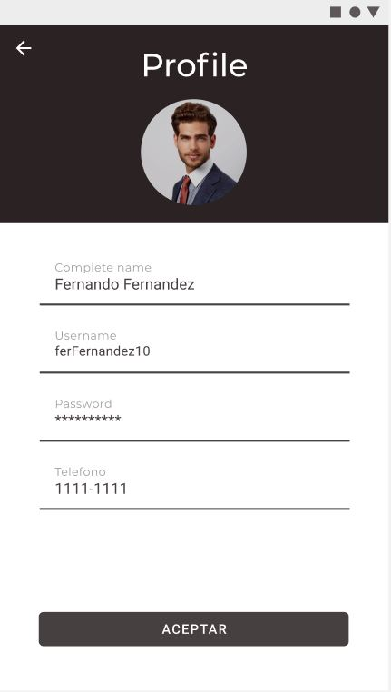 
<br><br><br><br><br>En este apartado el usuario podrá modificar su información personal de su cuenta. Podrá cambiar su foto de perfil, contraseña, correo electrónico y numero telefónico. <br><br><br><br><br><br>

### Mis propiedades
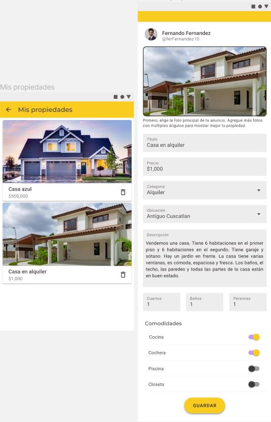
<br><br><br><br>En este aparatado el usuario puede ver todas las propiedades que ha publicado hasta el momento y podrá administrarlas. Contara con la opción de eliminarlas utilizando el icono del basurero y también podrá editar la información dándole click a la card deseada. En el area de modificar el usuario podrá prácticamente cambiar todos los valores de su anuncio como precio, descripción, comodidades, cantidad de cuartos y ubicación por mencionar algunos.<br><br><br><br><br>

### Storyboard 
Breve descripción visual de la funcionalidad que tiene la aplicación, da una idea al usuario de donde sera redireccionado al apretar cierto objeto de la pagina en la que se encuentra.
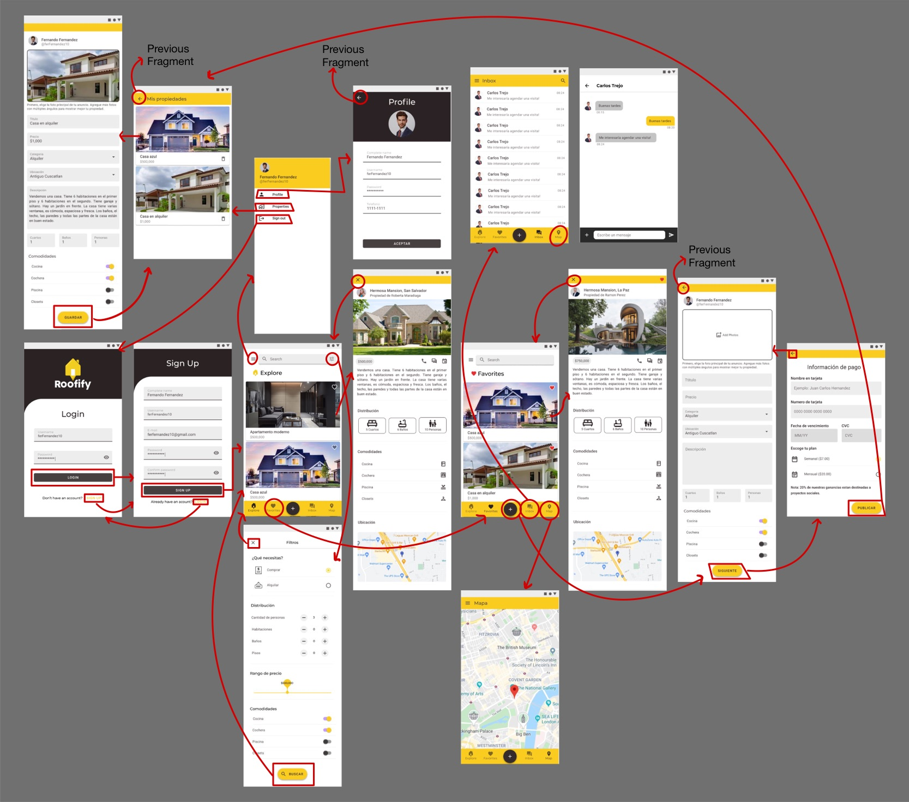

## API
Construida con node.js, express y mongodb para manejar sesiones, registro de usuarios y manejo de publicaciones. Alojada en heroku.

### Instalación(uso local)
Use the package manager [npm] to install.

```bash
npm install
```

### Uso

```bash
npm start
```

## Rutas
https://proyecto-pdm.herokuapp.com

### **Autenticación:** *https://proyecto-pdm.herokuapp.com/api/auth*

Método | Ruta | Descripción | Parámetros 
------------ | -------------|------------ | -------------
POST | https://proyecto-pdm.herokuapp.com/api/auth/signup| Registrar nuevo usuario |  **username**(string, required, unique)  **email**(string, required, unique)  **password**(string,)  **name** (string required) **photo**(buffer)
POST | https://proyecto-pdm.herokuapp.com/api/auth/signin | Iniciar Sesión |- **"identifier": Username o Email** - **Password**


Requieren token bearer asignado en el login con vigencia de 15 dias:
### **Usuarios:** *https://proyecto-pdm.herokuapp.com/api/user*


Método | Ruta | Descripción | Parámetros 
------------ | -------------|------------ | -------------
GET | https://proyecto-pdm.herokuapp.com/api/user/| Obtiene los datos del usuario loggeado sin incluir las publicaciones de este (incluye los favoritos) |  
GET | https://proyecto-pdm.herokuapp.com/api/user/profile/:_id | Obtener datos de un usuario y sus publicaciones  | Id de usuario 
PUT | https://proyecto-pdm.herokuapp.com/api/user | Actualizar los datos de un usuario loggeado |  Datos a cambiar
PATCH | https://proyecto-pdm.herokuapp.com/api/user/profile/savepost/:_id | Añade una publicación a los favoritos del usuario loggeado|  Id de post 


### **Publicaciones:** *https://proyecto-pdm.herokuapp.com/api/post*

Método | Ruta | Descripción | Parámetros 
------------ | -------------|------------ | -------------
POST| https://proyecto-pdm.herokuapp.com/api/post | Crear nueva publicacion | title, description, image, price, category, location, rooms, bathrooms, capacity, commodities 
GET | https://proyecto-pdm.herokuapp.com/api/post/id/:_id | Obtener publicación por id   | Id de post
GET | https://proyecto-pdm.herokuapp.com/api/post/all | Obtener todos las publicaciones (paginación de 10 ) |  
GET | https://proyecto-pdm.herokuapp.com/api/post/user | Obtener las publicaciones del usuario loggeado |  
PUT | https://proyecto-pdm.herokuapp.com/api/post/update/:_id | Actualizar datos de una publicacion |  Datos a cambiar del post 
DELETE | https://proyecto-pdm.herokuapp.com/api/post/delete/:_id |Borrar una publicación  |  Id de post 

### **Imagenes:** *https://proyecto-pdm.herokuapp.com/uploads/<imagen de post  o foto de perfil\>* 


### Ejemplos de respuesta de usuario y de publicación 
#### Usuario 
https://proyecto-pdm.herokuapp.com/api/user
```json
{
  "savedPosts": [],
  "_id": "60dfd7e5d48c1f1ff058fc30",
  "username": "UsernameDePrueba",
  "email": "email@email.com",
  "name": "John Doe",
  "photo": "foto.jpg",
  "createdAt": "2021-07-03T03:22:13.637Z",
  "updatedAt": "2021-07-03T04:05:40.213Z",
  "__v": 2
}
```
#### Publicacion 
https://proyecto-pdm.herokuapp.com/api/post/id/60dfeb5eca83ef3014ff2b04
```json
{
"_id":"60dfea98d48c1f1ff058fc31",
"price":150000,
"title":"Casa en Residencial Fantasma",
"description":"Casa con 4 habitaciones en residencial fantasma",
"image":"fotodecasa.jpg",
"category":"Venta",
"location":"San Salvador, San Salvador",
"rooms":4,
"bathrooms":2,
"capacity":5,
"commodities":"Aire Acondicionado, Piscina",
"user": {
         "_id": "60dfd7e5d48c1f1ff058fc30",
         "username": "UsernameDePrueba"
        },
"createdAt": "2021-07-03T04:45:18.110Z",
"updatedAt": "2021-07-03T04:45:18.110Z",
"__v":0
}
```


